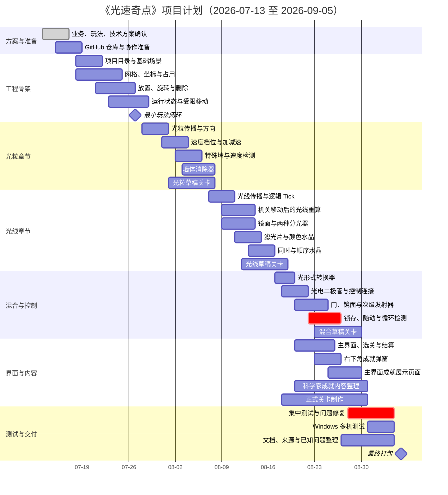

# 《光速奇点》项目管理

> 版本：v0.5  
> 状态：内部执行更新稿  
> 项目成员：陈俊贤、潘陈俣、张梓涵  
> 项目周期：2026 年 7 月 13 日—2026 年 9 月 5 日  
> 目标平台：Windows 10/11 x86_64

## 1. 文档用途

本文只记录项目分工、阶段安排、任务管理、协作流程、风险和验收要求。

玩法规则以《光速奇点_玩法设计》为准，技术方案以《光速奇点_开发规范兼技术栈》为准，业务目标以《光速奇点_实际业务》为准。

## 2. 项目目标

在 2026 年 9 月 5 日前完成一个可以在 Windows 10/11 上独立运行的《光速奇点》版本。

项目完成时至少应具备：

- 完整的主界面、选关、关卡、暂停、重置、结算和退出流程；
- 能够支撑正式关卡的核心玩法系统；
- 发射后机关配置锁定、运行期机关移动和墙体消除器；
- 科学家主题成就弹窗；
- 主界面的成就展示页面；
- 一组经过测试的正式关卡；
- 可运行的 Windows 游戏包；
- 完整 GitHub 源代码仓库；
- README、资源来源、已知问题和项目文档。

## 3. 团队分工

| 成员 | 主要方向 | 主要负责 | 需要交出的结果 |
|---|---|---|---|
| 陈俊贤 | 技术与核心系统 | 工程结构、网格系统、运行状态机、光传播、运行期移动队列、公共接口、关卡加载与重置、存档、成就系统基础、Windows 导出、GitHub 技术维护 | 可运行工程骨架、核心系统、测试场景、构建版本 |
| 潘陈俣 | 玩法系统 | 发射、光粒与光线、机关、水晶、检测器、墙体消除器、光电控制、运行期移动交互反馈、玩法测试 | 可以完整运行的玩法闭环、机关系统和规则测试 |
| 张梓涵 | 关卡与内容 | TileMapLayer、可消除墙标记、关卡模板、正式关卡、运行期移动教学顺序、美术资源、界面文字、科学家成就内容、资源来源记录 | 关卡场景、成就内容、视觉资源、逐关测试记录 |

主责表示该成员负责把对应内容推进到可用状态，不代表其他成员不能参与。

涉及公共接口、玩法规则、关卡范围或计划日期的明显变化，需要三人先讨论再修改。

## 4. 工作方式

### 4.1 任务来源

所有主要任务优先记录在 GitHub Issues 中。

一个任务至少说明：

- 要解决什么；
- 负责人是谁；
- 完成标准是什么；
- 会影响哪些模块或文件；
- 是否依赖其他任务；
- 当前是否被阻塞。

每个人同时进行的主要任务尽量不超过 1—2 个。

### 4.2 开发流程

1. 从 GitHub Issues 选择任务；
2. 从最新 `main` 创建任务分支；
3. 在本地完成开发和测试；
4. 使用小提交记录过程；
5. 推送分支并创建 Pull Request；
6. 至少一名队友检查或运行；
7. 修正问题后合并到 `main`；
8. 关闭 Issue 并删除完成分支。

### 4.3 每周检查

每周至少进行一次简短检查，回答：

- 本周完成了什么；
- 当前哪个任务被阻塞；
- 下周最重要的目标是什么；
- 是否需要删减范围；
- `main` 是否仍然可运行；
- 是否产生新的高风险问题。

不要求写长篇会议纪要，结论记录在 GitHub Issue、Project 或 `docs/progress/` 中即可。

## 5. 项目阶段

### 阶段一：玩法与技术方案确认

时间：2026 年 7 月 13 日—7 月 17 日

完成标准：

- 实际业务、玩法和技术方案基本确定；
- 团队成员理解各自方向；
- GitHub 仓库准备完成；
- 不再继续无边界扩展玩法。

### 阶段二：工程骨架与最小闭环

时间：2026 年 7 月 18 日—7 月 27 日

完成标准：

- 项目目录和基础场景建立；
- 网格、坐标、占用和放置可用；
- 运行状态机和机关配置锁定可用；
- 至少一种单格玩家机关可以在发射后移动；
- 固定发射源可发射；
- 基础镜面和基础水晶可用；
- 能完成“布置—发射—点亮—重置”的最小闭环；
- `main` 可以在三名成员电脑上打开运行。

### 阶段三：光粒章节系统

时间：2026 年 7 月 28 日—8 月 6 日

完成标准：

- 光粒传播可用；
- 速度档位、加速器、减速器可用；
- 特殊墙和速度检测门可用；
- 墙体消除器和可消除墙可用；
- 运行期移动不会使光粒回溯；
- 光粒相关水晶和基础关卡可测试；
- 光粒章节至少有若干可通关草稿关卡。

### 阶段四：光线章节系统

时间：2026 年 8 月 7 日—8 月 16 日

完成标准：

- 光线八方向传播可用；
- 玩家机关移动后，持续光线能够稳定全量重算；
- 斜面镜、长平面镜和两种分光器可用；
- 红、绿、蓝滤光片可用；
- 颜色水晶、光线水晶、顺序和同时机制可测试；
- 光线章节至少有若干可通关草稿关卡。

### 阶段五：混合与控制系统

时间：2026 年 8 月 17 日—8 月 25 日

完成标准：

- 光形式转换器可用，且发射后输出方向和模式正确锁定；
- 光电二极管可用；
- 电控门、电动镜面和次级发射器可用；
- 锁存模式可用；
- 随动模式在限制条件下可用；
- 重复状态检测能够阻止无限振荡；
- 混合章节关卡可以开始制作。

### 阶段六：成就、界面与正式关卡

时间：2026 年 8 月 20 日—8 月 30 日

完成标准：

- 主界面、选关、暂停和结算流程完整；
- 右下角成就弹窗可用；
- 主界面成就展示页面可用；
- 戴琼海院士等科学家的成就内容进入游戏；
- 正式关卡完成主要布局和教学；
- 资料来源和资源授权开始整理。

### 阶段七：冻结、测试和打包

时间：2026 年 8 月 31 日—9 月 5 日

完成标准：

- 停止新增高风险机制；
- 只处理错误、反馈、关卡和打包问题；
- 至少两台 Windows 电脑测试；
- 没有必现崩溃和主流程阻断；
- Windows 游戏包、源项目和文档齐全。

## 6. 甘特图

> 下面使用 Mermaid 甘特图。支持 Mermaid 的 Markdown 阅读器或 GitHub 页面可以直接渲染。

## 7. 里程碑

| 日期 | 里程碑 | 必须达到的状态 |
|---|---|---|
| 7 月 17 日 | 方案确认 | 三篇基础文档完成，玩法不再大规模扩张 |
| 7 月 27 日 | 最小闭环 | 能摆放、发射、锁定配置、运行期移动单格机关、点亮基础水晶并重置 |
| 8 月 6 日 | 光粒系统 | 光粒章节核心规则、墙体消除器和移动后非回溯规则可用 |
| 8 月 16 日 | 光线系统 | 镜面、分光、颜色、主要水晶和移动后的持续光线重算可用 |
| 8 月 25 日 | 混合控制 | 转换器、二极管和三种被控机关可用 |
| 8 月 30 日 | 内容齐备 | 主要关卡、成就弹窗和成就展示页面可测试 |
| 9 月 5 日 | 最终交付 | Windows 包、源项目和文档齐全 |

## 8. 完成标准

一个任务只有满足以下条件才算完成：

- 对应功能或内容已经实际存在；
- 在测试场景或正式关卡中能够运行；
- 常见重置和重复进入没有明显残留；
- 至少一名队友完成检查；
- 已通过 Pull Request 合并到 `main`；
- 已知问题已经记录；
- 不是只存在于个人电脑或未合并分支。

## 9. 问题等级

| 等级 | 含义 | 处理方式 |
|---|---|---|
| S0 | 项目打不开、必现崩溃、存档损坏、主流程完全阻断 | 停止新增内容，立即修复 |
| S1 | 核心机关错误、关卡无法完成、重置后状态错乱 | 当前阶段内解决 |
| S2 | 明显反馈、界面、文本或局部表现问题 | 记录后按时间处理 |
| S3 | 不影响使用的小问题 | 有时间再修或记录为已知问题 |

最终版本必须做到：

- S0 为 0；
- 不保留已知的主流程 S1；
- S2 和 S3 有明确记录。

## 10. 主要风险

| 风险 | 早期信号 | 处理方式 |
|---|---|---|
| 玩法范围继续扩大 | 频繁增加新机关和水晶类型 | 新想法先记录，不直接进入当前版本 |
| 运行期移动引发状态混乱 | 同一 Tick 的光看到不同布局、旧占用残留 | 使用移动请求队列、占用快照和批次结束后原子提交 |
| 光线重算成本或循环过高 | 每次拖动都重复清理和生成路径 | 首版限制可移动机关数量，移动完成后再重算，不随鼠标每帧重算 |
| 墙体消除器破坏关卡结构 | 一个道具逐步永久删除多面墙 | 使用临时失效规则，移走后旧墙恢复，只允许标记墙体 |
| 光电随动系统过于复杂 | 门和镜面反复变化、难以稳定 | 限制连接关系，优先锁存，必要时删减随动关卡 |
| 核心工程进度落后 | 7 月底仍没有最小闭环 | 暂停界面和美术，集中完成网格与传播 |
| 关卡制作开始过晚 | 8 月中旬只有测试场景 | 核心接口稳定后立即制作草稿关卡 |
| Godot 场景冲突 | 多人同时修改同一 `.tscn` | 每关独立场景，提前认领文件 |
| AI 代码难以维护 | 代码能运行但成员无法解释 | 缩小 AI 任务范围，增加测试和人工审查 |
| 科学家内容失实 | 文案缺少来源或使用网络传言 | 未审核内容不进入正式版本 |
| 成就系统拖慢主流程 | 为成就制作大量额外规则 | 成就只监听已有玩法事件，不改变核心规则 |
| 最终包只在一台电脑运行 | 绝对路径、版本或资源缺失 | 提前进行多机拉取和导出测试 |

## 11. 范围删减顺序

如果进度明显落后，按以下顺序删减：

1. 复杂动画和过渡；
2. 关卡评价和额外统计；
3. 非核心音效；
4. 成就展示页面的筛选、分类和解锁时间；
5. 正式关卡数量或后期关卡规模；
6. 多格机关的运行期移动，首版只保留单格机关；
7. 部分随动控制关卡；
8. 将高风险随动机关改为锁存模式。

不优先删除：

- 固定发射源与布置阶段；
- 发射后机关配置锁定；
- 至少一种单格机关的运行期移动；
- 墙体消除器的临时失效规则；
- 光粒和光线基本区别；
- 基础镜面；
- 基础水晶；
- 重置功能；
- 科学家主题成就弹窗；
- 主界面成就展示入口；
- Windows 导出和源项目。

## 12. 最终交付清单

- Windows 10/11 x86_64 游戏包；
- GitHub 中的完整 Godot 源项目；
- 正式关卡；
- 主界面和选关流程；
- 右下角成就弹窗；
- 主界面成就展示页面；
- 戴琼海院士等科学家的成就内容；
- README；
- 资料来源记录；
- 外部素材授权记录；
- 已知问题清单；
- 实际业务文档；
- 玩法设计文档；
- 开发规范兼技术栈文档；
- 项目管理文档。
