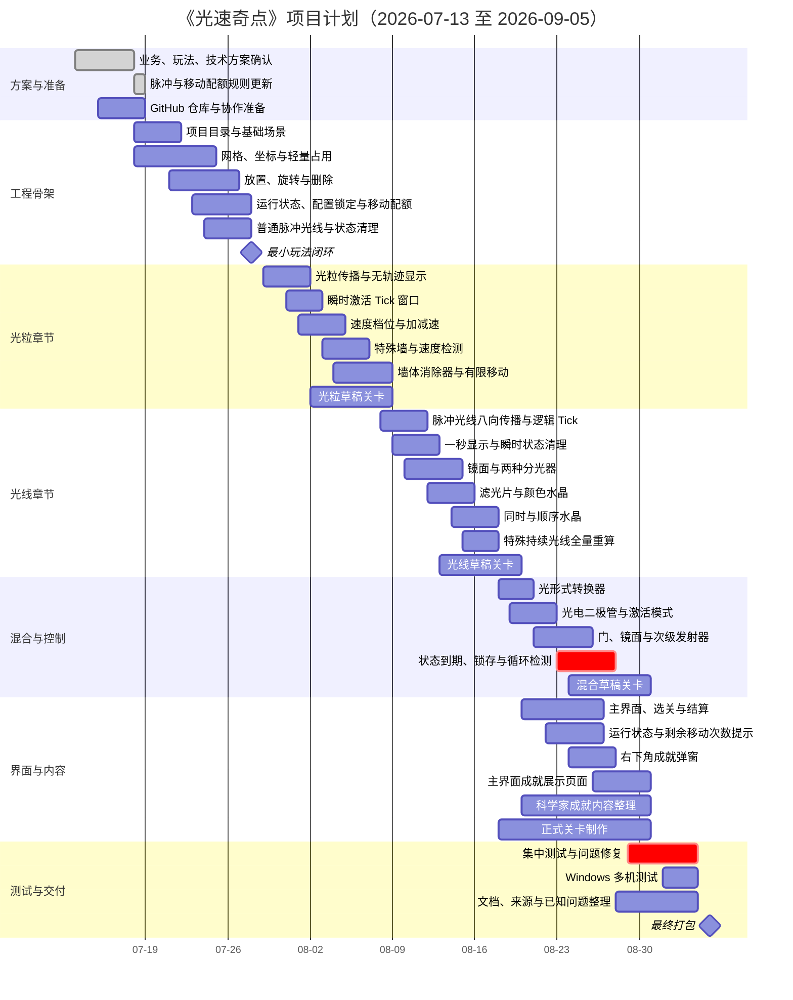

# 《光速奇点》项目管理

> 版本：v0.6  
> 状态：脉冲光线与运行期移动配额执行更新稿  
> 项目成员：陈俊贤、潘陈俣、张梓涵  
> 项目周期：2026 年 7 月 13 日—2026 年 9 月 5 日  
> 目标平台：Windows 10/11 x86_64

## 1. 文档用途

本文只记录项目分工、阶段安排、任务管理、协作流程、风险和验收要求。

玩法规则以《光速奇点_玩法设计》为准，技术方案以《光速奇点_开发规范兼技术栈》为准，业务目标以《光速奇点_实际业务》为准。

## 2. 项目目标

在 2026 年 9 月 5 日前完成一个可以在 Windows 10/11 上独立运行的《光速奇点》版本。

项目完成时至少应具备：

- 完整的主界面、选关、关卡、暂停、重置、结算和退出流程；
- 能够支撑正式关卡的核心玩法系统；
- 普通主发射源的脉冲光线；
- 不留下持续轨迹的光粒；
- 瞬时/随动和锁存两种状态生命周期；
- 发射后机关配置锁定；
- 每关有限的运行期移动次数和确定性提交；
- 墙体消除器与可消除墙；
- 科学家主题成就弹窗；
- 主界面的成就展示页面；
- 一组经过测试的正式关卡；
- 可运行的 Windows 游戏包；
- 完整 GitHub 源代码仓库；
- README、资源来源、已知问题和项目文档。

普通主发射源不默认产生永久持续光线。持续光线只作为少量后期特殊机制，不能成为全部光线关卡的基础。

## 3. 团队分工

| 成员 | 主要方向 | 主要负责 | 需要交出的结果 |
|---|---|---|---|
| 陈俊贤 | 技术与核心系统 | 工程结构、网格与占用、运行状态、脉冲光线生命周期、光粒 Tick、运行期移动配额与请求队列、公共接口、关卡加载与重置、存档、成就系统基础、Windows 导出、GitHub 技术维护 | 可运行工程骨架、确定性核心系统、测试场景、构建版本 |
| 潘陈俣 | 玩法系统 | 发射、光粒与脉冲光线、瞬时/锁存规则、机关、水晶、检测器、墙体消除器、光电控制、运行期移动反馈、玩法测试 | 可以完整运行的玩法闭环、机关系统、状态生命周期和规则测试 |
| 张梓涵 | 关卡与内容 | TileMapLayer、可消除墙标记、关卡模板、正式关卡、移动次数配置与教学顺序、美术资源、界面文字、科学家成就内容、资源来源记录 | 关卡场景、移动配额与状态提示、成就内容、视觉资源、逐关测试记录 |

主责表示该成员负责把对应内容推进到可用状态，不代表其他成员不能参与。

涉及公共接口、玩法规则、关卡范围、激活窗口、移动次数或计划日期的明显变化，需要三人先讨论再修改。

## 4. 工作方式

### 4.1 任务来源

所有主要任务优先记录在 GitHub Issues 中。

一个任务至少说明：

- 要解决什么；
- 负责人是谁；
- 完成标准是什么；
- 会影响哪些模块或文件；
- 是否依赖其他任务；
- 当前是否被阻塞。

每个人同时进行的主要任务尽量不超过 1—2 个。

### 4.2 开发流程

1. 从 GitHub Issues 选择任务；
2. 从最新 `main` 创建任务分支；
3. 在本地完成开发和测试；
4. 使用小提交记录过程；
5. 推送分支并创建 Pull Request；
6. 至少一名队友检查或运行；
7. 修正问题后合并到 `main`；
8. 关闭 Issue 并删除完成分支。

### 4.3 每周检查

每周至少进行一次简短检查，回答：

- 本周完成了什么；
- 当前哪个任务被阻塞；
- 下周最重要的目标是什么；
- 是否需要删减范围；
- `main` 是否仍然可运行；
- 是否产生新的高风险问题。

不要求写长篇会议纪要，结论记录在 GitHub Issue、Project 或 `docs/progress/` 中即可。

## 5. 项目阶段

### 阶段一：玩法与技术方案确认

时间：2026 年 7 月 13 日—7 月 18 日

完成标准：

- 实际业务、玩法、项目管理和技术方案基本确定；
- 明确普通脉冲光线、无轨迹光粒、瞬时/锁存状态和有限运行期移动；
- 团队成员理解各自方向；
- GitHub 仓库准备完成；
- 不再继续无边界扩展玩法。

### 阶段二：工程骨架与最小闭环

时间：2026 年 7 月 18 日—7 月 28 日

完成标准：

- 项目目录和基础场景建立；
- 网格、坐标、轻量占用和放置可用；
- 运行状态、机关配置锁定和运行期移动次数可用；
- 普通光线可以完成一次脉冲、显示约 1 秒并清理瞬时状态；
- 基础水晶至少支持瞬时和锁存两种模式；
- 至少一种单格玩家机关可以在有限移动次数内移动；
- 固定发射源、基础镜面和基础水晶可用；
- 能完成“布置—发射脉冲—激活—有限移动—再次发射—重置”的最小闭环；
- `main` 可以在三名成员电脑上打开运行。

### 阶段三：光粒章节系统

时间：2026 年 7 月 29 日—8 月 7 日

完成标准：

- 光粒按整数 Tick 逐格传播；
- 光粒不留下持续轨迹；
- 光粒触发的瞬时状态使用固定 Tick 窗口，默认表现约 1 秒；
- 速度档位、加速器、减速器可用；
- 特殊墙和速度检测门可用；
- 墙体消除器和可消除墙可用；
- 运行期移动受到移动次数限制；
- 机关移动不会使光粒回溯；
- 光粒相关水晶和基础关卡可测试；
- 光粒章节至少有若干可通关草稿关卡。

### 阶段四：光线章节系统

时间：2026 年 8 月 8 日—8 月 17 日

完成标准：

- 普通脉冲光线支持八方向传播；
- 路径默认显示约 1 秒并按脉冲结束清理；
- 水晶和光电目标的瞬时/锁存状态可用；
- 机关在脉冲结束后移动，下一次发射按新布局重新计算；
- 斜面镜、长平面镜和两种分光器可用；
- 红、绿、蓝滤光片可用；
- 颜色水晶、光线水晶、顺序和同时机制可测试；
- 少量特殊持续光线可在必要时全量重算；
- 光线章节至少有若干可通关草稿关卡。

### 阶段五：混合与控制系统

时间：2026 年 8 月 18 日—8 月 26 日

完成标准：

- 光形式转换器可用，且发射后输出方向和模式正确锁定；
- 光电二极管支持瞬时/随动与锁存；
- 电控门、电动镜面和次级发射器可用；
- 次级脉冲光线发射器可用；
- 特殊持续光线只在明确机关中启用；
- 状态到期和恢复在逻辑批次边界结算；
- 重复状态检测能够阻止无限振荡；
- 混合章节关卡可以开始制作。

### 阶段六：成就、界面与正式关卡

时间：2026 年 8 月 20 日—8 月 31 日

完成标准：

- 主界面、选关、暂停和结算流程完整；
- 右下角成就弹窗可用；
- 主界面成就展示页面可用；
- 戴琼海院士等科学家的成就内容进入游戏；
- 正式关卡完成主要布局和教学；
- 界面能够清楚显示激活模式、脉冲状态和剩余移动次数；
- 资料来源和资源授权开始整理。

### 阶段七：冻结、测试和打包

时间：2026 年 9 月 1 日—9 月 5 日

完成标准：

- 停止新增高风险机制；
- 只处理错误、反馈、关卡和打包问题；
- 至少两台 Windows 电脑测试；
- 没有必现崩溃和主流程阻断；
- 不存在无限移动绕过关卡或状态无法恢复的已知 S1；
- Windows 游戏包、源项目和文档齐全。

## 6. 甘特图

> 下面使用 Mermaid 甘特图。支持 Mermaid 的 Markdown 阅读器或 GitHub 页面可以直接渲染。

## 7. 里程碑

| 日期 | 里程碑 | 必须达到的状态 |
|---|---|---|
| 7 月 18 日 | 方案确认 | 四篇基础文档完成，明确脉冲光线、状态生命周期和有限移动 |
| 7 月 28 日 | 最小闭环 | 能摆放、发射脉冲、锁定配置、有限移动单格机关、处理瞬时/锁存水晶并重置 |
| 8 月 7 日 | 光粒系统 | 光粒无轨迹、Tick 激活窗口、墙体消除器和移动后非回溯规则可用 |
| 8 月 17 日 | 光线系统 | 脉冲光线、镜面、分光、颜色、主要水晶和少量特殊持续光线可用 |
| 8 月 26 日 | 混合控制 | 转换器、二极管、瞬时/锁存控制和三种被控机关可用 |
| 8 月 31 日 | 内容齐备 | 主要关卡、移动次数提示、成就弹窗和成就展示页面可测试 |
| 9 月 5 日 | 最终交付 | Windows 包、源项目和文档齐全 |

## 8. 完成标准

一个任务只有满足以下条件才算完成：

- 对应功能或内容已经实际存在；
- 在测试场景或正式关卡中能够运行；
- 常见重置和重复进入没有明显残留；
- 至少一名队友完成检查；
- 已通过 Pull Request 合并到 `main`；
- 已知问题已经记录；
- 不是只存在于个人电脑或未合并分支。

## 9. 问题等级

| 等级 | 含义 | 处理方式 |
|---|---|---|
| S0 | 项目打不开、必现崩溃、存档损坏、主流程完全阻断 | 停止新增内容，立即修复 |
| S1 | 核心机关错误、关卡无法完成、重置后状态错乱 | 当前阶段内解决 |
| S2 | 明显反馈、界面、文本或局部表现问题 | 记录后按时间处理 |
| S3 | 不影响使用的小问题 | 有时间再修或记录为已知问题 |

最终版本必须做到：

- S0 为 0；
- 不保留已知的主流程 S1；
- S2 和 S3 有明确记录。

## 10. 主要风险

| 风险 | 早期信号 | 处理方式 |
|---|---|---|
| 玩法范围继续扩大 | 频繁增加新机关和水晶类型 | 新想法先记录，不直接进入当前版本 |
| 无限运行期移动破坏关卡 | 玩家用一个机关反复移动完成多个目标 | 每关设置 `runtime_move_limit`，只在成功提交时扣除，UI持续显示剩余次数 |
| 脉冲与状态到期不确定 | 不同帧率下目标恢复时间不同 | 使用固定逻辑 Tick 和脉冲结束事件，不用帧率驱动核心判定 |
| 运行期移动引发状态混乱 | 同一 Tick 的光看到不同布局、旧占用残留 | 使用移动请求队列、占用快照和批次结束后原子提交 |
| 普通光线被误做成持续重算 | 每次拖动都清理和生成全部路径 | 普通主光线只在再次发射时重算，持续重算仅用于特殊持续光源 |
| 光粒留下轨迹造成误判 | 玩家把残影当作仍然有效的光 | 只显示当前粒子；可选残影不得参与逻辑且快速消失 |
| 墙体消除器破坏关卡结构 | 一个道具逐步永久删除多面墙 | 使用临时失效规则、有限移动次数，移走后旧墙恢复 |
| 光电随动系统过于复杂 | 门和镜面反复变化、难以稳定 | 限制连接关系，先实现锁存，再实现少量随动关卡 |
| 核心工程进度落后 | 7 月底仍没有最小闭环 | 暂停界面和美术，集中完成网格、脉冲和状态生命周期 |
| 关卡制作开始过晚 | 8 月中旬只有测试场景 | 核心接口稳定后立即制作草稿关卡 |
| Godot 场景冲突 | 多人同时修改同一 `.tscn` | 每关独立场景，提前认领文件 |
| AI 代码难以维护 | 代码能运行但成员无法解释 | 缩小 AI 任务范围，要求模块与函数中文注释，增加测试和人工审查 |
| 科学家内容失实 | 文案缺少来源或使用网络传言 | 未审核内容不进入正式版本 |
| 成就系统拖慢主流程 | 为成就制作大量额外规则 | 成就只监听已有玩法事件，不改变核心规则 |
| 最终包只在一台电脑运行 | 绝对路径、版本或资源缺失 | 提前进行多机拉取和导出测试 |

## 11. 范围删减顺序

如果进度明显落后，按以下顺序删减：

1. 复杂动画和过渡；
2. 关卡评价和额外统计；
3. 非核心音效；
4. 成就展示页面的筛选、分类和解锁时间；
5. 正式关卡数量或后期关卡规模；
6. 特殊持续光线关卡；
7. 多格机关的运行期移动，首版只保留单格机关；
8. 将运行期移动上限统一缩减为 0 或 1；
9. 部分瞬时/随动控制关卡；
10. 将高风险随动机关改为锁存模式。

不优先删除：

- 固定发射源与布置阶段；
- 普通脉冲光线；
- 光粒无轨迹和固定 Tick 激活窗口；
- 瞬时/锁存基本区别；
- 发射后机关配置锁定；
- 每关明确的运行期移动次数；
- 至少一种单格机关的有限运行期移动；
- 墙体消除器的临时失效规则；
- 光粒和光线基本区别；
- 基础镜面；
- 基础水晶；
- 重置功能；
- 科学家主题成就弹窗；
- 主界面成就展示入口；
- Windows 导出和源项目。

## 12. 最终交付清单

- Windows 10/11 x86_64 游戏包；
- GitHub 中的完整 Godot 源项目；
- 正式关卡；
- 主界面和选关流程；
- 右下角成就弹窗；
- 主界面成就展示页面；
- 戴琼海院士等科学家的成就内容；
- README；
- 资料来源记录；
- 外部素材授权记录；
- 已知问题清单；
- 实际业务文档；
- 玩法设计文档；
- 开发规范兼技术栈文档；
- 项目管理文档。
