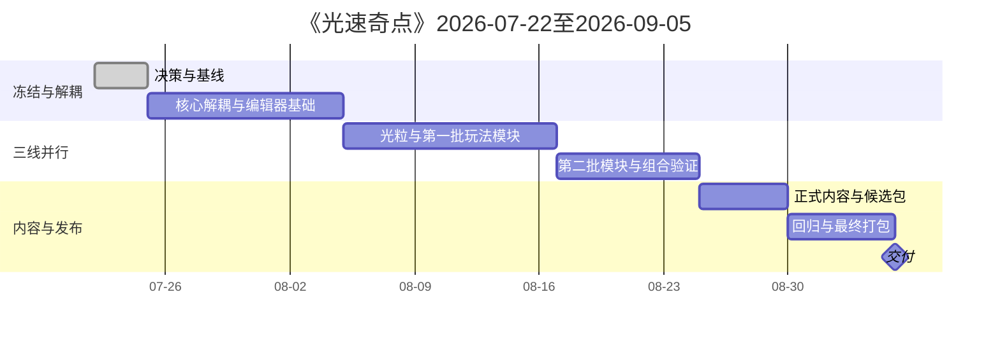

# 《光速奇点》项目管理

> 版本：v0.7
> 更新日期：2026 年 7 月 29 日
> 截止日期：2026 年 9 月 5 日
> 团队：陈俊贤、潘陈俣、张梓涵
> 目标平台：Windows 10/11 x86_64

---

> 状态说明
>
> 本文同时包含原计划基线和当前实际进度。
> 时间计划、P0/P1/P2 分级和截止日期是管理目标，不等于当前代码完成清单。
> 实际实施状态以真实 Git、代码和运行结果为准；本文“实际进度”小节仅做同步，不替代代码与运行验证。

---

# 1. 管理目标

在9月5日前交付一个：

- 可独立运行；
- 有三章节结构；
- 支持光线和光粒；
- 可在Godot GUI制作关卡；
- 有最小科学家成就内容；
- 有Windows构建；
- 可继续扩展完整设计的版本。

9月5日是阶段性交付，不是完整设计永久结束。附加内容进入9月5日后的继续开发路线。

---

# 2. 范围分级

## P0：9月5日前必须完成

> 本节是 9 月 5 日前的交付范围，不代表列表内容当前已经全部实现。当前实现状态见“2026 年 7 月 29 日实际进度”小节。

- 模块解耦；
- GUI网格吸附；
- 八方向固定发射器（RAY/PARTICLE 最终目标均为八方向；当前真实代码 Ray 已八方向、Particle 仍四正方向，Particle 八方向未实现）；
- 开始运行按钮；
- 普通光线；
- 光粒；
- 基础镜面；
- 加速和减速；
- 一种光粒专属墙体；
- 基础和光形态水晶；
- 运行期布局编辑；
- 移动次数；
- R重置；
- 三章节代表关卡；
- 主界面和选关；
- 最小存档；
- 1位重点科学家；
- 3项成就；
- Windows包。

## P1：阶段附加

- 长镜面；
- 分光器；
- 滤光片；
- 颜色水晶；
- 转换器；
- 墙体消除器；
- 同时/顺序水晶。

## P2：9月5日后完整开发

- 光电二极管；
- 电控门；
- 电动镜面；
- 次级发射器；
- 特殊持续光线；
- 更多科学家和成就；
- 完整章节关卡；
- 更完整声音、动画、设置和内容。

---

# 3. 时间计划

| 阶段 | 日期 | 里程碑 |
|---|---|---|
| 阶段0 | 7月22日晚—7月24日 | 决策、文档、分支和测试基线 |
| 阶段1 | 7月25日—8月4日 | 核心解耦、编辑器关卡基础 |
| 阶段2 | 8月5日—8月16日 | 光粒与第一批机关，三线并行 |
| 阶段3 | 8月17日—8月24日 | 第二批内容、组合验证、功能冻结 |
| 阶段4 | 8月25日—8月29日 | 正式内容、首个候选包 |
| 阶段5 | 8月30日—9月4日 | 回归、修复和最终构建 |
| 交付 | 9月5日 | 最终确认和备份 |

阶段内开发顺序（D2.6 起）：D2.6 文档重扫 → D3A `GridPlacedObject` 位置契约重构 → D3B `EmitterConfigNode` → D3C `EmissionPreview` 与真实光线接线 → D4 `BasicCrystal` 接入 → D5 模板和四层 TileMapLayer → D6 `LevelValidator` → D7A 美术配置插件 → D7C 张梓涵 GUI 验收 → D8 解耦、回归与文档收口。（D7B 关卡工具插件 / 第二正式 EditorPlugin 已永久取消，不延期。）



---

# 3.1 2026 年 7 月 29 日实际进度

> 本小节同步真实进度，不修改原时间计划与截止日期。实施状态以真实 Git、代码和运行结果为准。无法从正式文档和代码确认的时间安排保持原样并标注待重新排期。

## 已完成或已建立

- 64×64 网格基线与坐标纯函数换算（`GridCoordinateRules` / `GridMetrics`）；
- 现有普通光线原型（逐格传播纯计算迁出为 `RayExecutionModule`）；
- 墙体、基础水晶（显式 `crystal_id`）、单格镜；
- 轻量占用（含原子单格移动）；
- 单槽库存（含归还预留）；
- 拖拽、放置、移动、回收（`DragFlowController`、`PlacementController` / `InventoryController`）；
- 回收事务失败一致性修复（机关回收 `commit` 失败时库存与场景保持一致，不再丢失机关）；
- 当前四状态（SETUP、PULSE_ACTIVE、MOVE_WINDOW、COMPLETED）；
- 运行状态所有权迁出核心：`RunStateController`，核心通过 `begin_pulse()`、`finish_pulse()`、`reset_to_setup()` 请求转换；
- 运行期编排迁出：`LevelRuntimeController` 唯一持有 `pulse_generation`、`runtime_moves_used`、发射编排、异步过期保护与 R 完整顺序；
- 世界只读查询迁出：`LevelWorldQuery` / `LightWorldQuery` / `RayMechanismAdapter` / `FireRequest` / `FixedEmitter`；
- 视觉迁出：`LightVisualController`；
- 水晶身份与目标迁出：`LevelObjectRegistry` / `ObjectiveController`；
- D3A `GridPlacedObject` 位置契约重构：已完成。`position` 是场景编辑事实，`cell` 由 `position` 派生，单格/多格锚点规范已建立基础；
- D3B `EmitterConfigNode`：已完成，继承 `GridPlacedObject`，作为发射器配置节点；
- D3C `EmissionPreview` 与真实光线接线：已完成，发射器真实光路端到端集成测试已落地；
- D4 `BasicCrystal` 接入：基础视觉与状态接口已完成；
- D7A 美术配置插件：已完成。当前只有一个正式 Godot EditorPlugin `addons/light_speed_art_profile/`，已在 `project.godot` 启用，含目标解析、资产浏览、Dock 面板、编辑服务与撤销保存；
- D5 正式关卡模板与四层 `TileMapLayer`：已完成（D5-A/A.1/B/C.1/C.2/C.3 全部 `COMPLETE`，PR #35–#44）。`TerrainLayer` 为不规则关卡内外唯一离散事实、`LegalAreaLayer` 为 Terrain 内允许放置子集、`WallLayer` 为普通静态阻挡、`DecorationLayer` 为纯视觉；`map_bounds`/`Rect2i` 退化为粗筛/兼容，不作为不规则地图真值；
- D6 `LevelValidator` v0：已完成（代码侧 `COMPLETE`，PR #45–#48）。只读结构化校验器，不生成 Tile、不补画、不修改/保存场景、不依赖 `addons/`、不恢复第二 EditorPlugin；Runtime/core 当前不自动调用 Validator（Runtime 自动 Validation Gate 仍未实现）；
- 编辑器方法 B（2D 视图拖动、64×64 吸附、写回逻辑 `cell`）：已完成；
- Godot 原生 GUI 关卡编辑基础（拖动、复制、吸附、`position` 的 Undo/Redo）：已完成；
- 墙体方向编辑（Wall Directional Authoring）：已完成；墙体四视觉轴 ─ │ / \ 在 gameplay 上完全等价；
- Diagnostics foundation：`DiagnosticsController`、`RuntimeLogger`、`RuntimeSnapshotData`、`SelfCheckCallable`、`SelfCheckRunner`、序列化与文件保存；七项启动自检编排迁出为 `StartupSelfCheckCoordinator`，真实运行；
- 日志和快照基础工具（轮转、数量和容量限制基础）；
- 核心测试文件按职责拆分：放置控制器、拖拽流程、关卡运行、发射器场景等测试均已按职责拆分；
- 部分永久视觉与关卡编辑接口契约（`docs/api/` v1.1）。

## 部分完成

- 编辑器方法 A（Inspector、视觉 Profile、资源配置）：当前可用的配置路径，但独立对象模板与场景编辑边界仍在完善；
- 正式可替换美术工作流：单一 Profile 插件已可用，独立 Profile 副本能力尚未实现；
- 独立对象模板与场景编辑边界：`GridPlacedObject` 基类已建立，全部固定对象完成迁移仍进行中；
- 关卡编辑辅助能力：方法 A 与方法 B 均已完成；Godot 原生 GUI 关卡编辑基础已完成。

## 未完成或延后

- 一键创建独立 Profile 副本、共享 Profile 自动转实例独立资源；
- 光线/光粒形态切换、统一 `EmissionRequest` / `LightRuntimeCoordinator` / 独立光粒模块、Particle Runtime；
- Particle 八方向（当前真实代码 Particle 仍为四正方向，八方向属最终目标未实现）；
- 发射器八方向实时控制（最终目标八方向；按键方案未冻结，不在本批设计）与对应提示 UI；
- 真实 `RuntimeSnapshot` 玩法自动采样和自动保存（当前仅支持调用方提供数据 → 序列化/保存）；
- 稳定 `crystal_id`、`LevelObjectRegistry`、多水晶统一注册的完整接线（基础已就绪，完整多水晶正式关卡未完成）；
- 完整 `ObjectiveController` 接线；
- `READY_TO_FIRE` 状态与正式“开始运行”入口；
- Runtime 自动 Validation Gate（运行期自动调用 `LevelValidator`；`LevelValidator` v0 本身已完成，但 Runtime/core 尚未自动调用）；
- 正式主界面、选关、最小存档、成就展示和 Windows 发布包；
- Debug 游戏内控制台。

## 当前下一开发入口

D5（正式关卡模板与四层 `TileMapLayer`）、D6（`LevelValidator` v0）、编辑器方法 B、Godot 原生 GUI 关卡编辑基础、墙体方向编辑均已完成。

仍未实现、构成后续开发入口的目标项：

- `READY_TO_FIRE` 状态与正式“开始运行”入口；
- Runtime 自动 Validation Gate（运行期自动调用 `LevelValidator`）；
- 统一 `EmissionRequest` / `LightForm` / 光运行公共层、独立光粒（Particle）模块与 Particle Runtime；
- 玩家实际 RAY/PARTICLE 切换、玩家实际八方向运行控制（八方向按键方案未冻结，不在本批设计）；
- Particle 八方向（当前真实代码 Particle 仍为四正方向）；
- 多 Crystal 正式关卡合同、真实 `RuntimeSnapshot` 采样、新机关批次、完整提示 UI。

再随后：在冻结接口内扩展正式机关和关卡内容。

D8 Diagnostics 当前结论是保持现有架构，在 foundation 上补强，不机械拆分，不作为立即进行的大规模重构任务。

---

# 4. 团队高层职责

本节只写高层职责，详细阶段分工见《光速奇点》各阶段团队分工与交付物 v0.9。

- 陈俊贤：核心架构、网格、运行控制、编辑器工具、跨模块集成、规范与最终审查；
- 潘陈俣：在冻结接口和对象模板内开发机关及机关测试；
- 张梓涵：使用正式编辑器工作流制作关卡、替换美术、配置状态图片和对象布局。

边界：

- 不得写成陈俊贤负责实现所有机关；
- 潘陈俣不得修改核心坐标、运行状态或放置协议；
- 张梓涵不需要编写代码或维护复杂底层 Inspector 数据。

---

# 5. 任务流程

```text
Issue
→ 规则和依赖确认
→ 从最新main建分支
→ 实施
→ 自动检查
→ 人工测试
→ 只读审查
→ PR
→ 队友运行
→ 合并main
→ 删除分支
```

每个人同时主要任务不超过2个。

Git 与协作状态：

- 当前主分支为 `main`；
- 陈俊贤分支标识为 `kud`；
- 每批从最新 `main` 创建短生命周期分支；
- 功能完成后推送、PR 合并，再本地拉取最新 `main`；
- `docs/ai/` 不提交；
- 不再使用 `phase_1/` / `phase_2/` 目录。

---

# 6. 任务完成定义

一个任务只有同时满足以下条件才完成：

```text
代码/内容存在
+ 可运行
+ 有测试步骤
+ 有实际测试结果
+ 已知问题已记录
+ 至少一名队友检查
+ 已合并main
+ main仍可运行
```

---

# 7. 重构管理

## 禁止大型重写

`core_loop_prototype.gd` 的迁移按顺序进行：

1. 基线记录；
2. Diagnostics foundation：已完成；
3. 运行状态所有权迁出（`RunStateController`）：已完成，四态不变，不含 `READY_TO_FIRE`；
4. 世界只读查询迁出（`LevelWorldQuery` / `LightWorldQuery` / `RayMechanismAdapter` / `RayExecutionModule` / `FireRequest` / `FixedEmitter`）：已完成；
5. 运行期编排迁出（`LevelRuntimeController` 持有 `pulse_generation` / `runtime_moves_used` / 发射 / 异步过期 / R 顺序）：已完成；
6. 交互与放置迁出（`PlayerInteractionController` / `DragContext` / `DragFlowController` / `PlacementController` / `InventoryController` / `OccupancyRegistry`）：已完成；
7. 视觉迁出（`LightVisualController`）：已完成；
8. 水晶身份与目标迁出（`BasicCrystal.crystal_id` / `LevelObjectRegistry` / `ObjectiveController`）：已完成；
9. 启动自检编排迁出（`StartupSelfCheckCoordinator`）：已完成；
10. `GridPlacedObject` 位置契约重构（D3A，已完成：position 为场景编辑事实，cell 由 position 派生）、`EmitterConfigNode`（D3B，已完成）、`EmissionPreview` 与真实光线接线（D3C，已完成）、`BasicCrystal` 接入（D4，基础视觉与状态接口已完成）、美术配置插件（D7A，已完成，单一 `EditorPlugin`）：已完成；模板和四层 TileMapLayer（D5，已完成）、`LevelValidator` v0（D6，已完成，只读结构化校验器）、GUI 验收（D7C，Godot 原生 GUI 关卡编辑基础已完成）、编辑器方法 B（已完成，2D 拖动、64×64 吸附、写回逻辑 `cell`）：已完成；关卡工具插件（D7B / 第二正式 EditorPlugin）已永久取消，不延期；`READY_TO_FIRE`、开始运行入口、统一光运行架构、光线/光粒切换、光粒（Particle Runtime）、真实 `RuntimeSnapshot` 采样、Runtime 自动 Validation Gate：后续未实现。

阶段顺序：D2.6 文档重扫 → D3A `GridPlacedObject` 位置契约重构 → D3B `EmitterConfigNode` → D3C `EmissionPreview` 与真实光线接线 → D4 `BasicCrystal` 接入 → D5 模板和四层 TileMapLayer → D6 `LevelValidator` → D7A 美术配置插件 → D7C 张梓涵 GUI 验收 → D8 解耦、回归与文档收口。其中 D3A、D3B、D3C、D4、D7A、D5、D6 均已完成，D7C（Godot 原生 GUI 关卡编辑基础）已完成。D7B 关卡工具插件 / 第二正式 EditorPlugin 已永久取消，不延期。Godot 原生负责节点拖动、复制、64×64 网格吸附和 position Undo/Redo，不另建吸附插件；运行时代码不得依赖 `addons/`，插件全部关闭后游戏正常运行。

第 2 项已作为 foundation 落地，后续 Diagnostics 相关增强在现有 foundation 上补强，不重新从零实现。第 3–9 项已完成行为保持式迁出，不代表 9 月 5 日交付或完整统一光运行架构完成；`READY_TO_FIRE`、开始运行入口、光线/光粒切换、光粒（Particle Runtime）、真实 `RuntimeSnapshot` 采样、Runtime 自动 Validation Gate 等仍未实现（编辑器方法 B、D5 模板与四层 TileMapLayer、D6 `LevelValidator` v0 已完成）。`core_loop_prototype.gd`、`runtime_logger.gd`、`runtime_snapshot.gd` 当前物理行较大，但职责审查通过，禁止仅按行数机械拆分。

每一步独立分支、独立回归。

## 停止条件

出现以下情况立即停止继续抽离：

- 主场景不能启动；
- R不能恢复；
- 占用不一致；
- 库存不一致；
- 光路结果改变；
- 拖拽回滚失效；
- 新模块需要直接改多个私有字段；
- 测试无法说明行为是否保持。

## Diagnostics 后续

Diagnostics foundation 已落地。D8 当前结论是保持现有架构，在 foundation 上补强，不机械拆分，不作为立即进行的大规模重构任务。方向包括：

- 真实 RuntimeSnapshot 玩法采样；
- Debug 游戏内控制台；
- 更多自检项；
- 与未来模块（发射器、光运行、关卡运行等）接线；
- 更完整的日志与快照能力。

---

# 8. 关卡管理

关卡分为：

- 模板；
- 单机关原型；
- 组合原型；
- 灰盒关卡；
- 正式章节关卡。

三章节不改变：

- 光粒；
- 光线；
- 混合。

9月5日前数量弹性，但每章必须有代表性正式内容。内部目标每章约2关，进度不足时缩小规模而不删除章节。

同一时间一名成员主改一个关卡场景，避免场景冲突。

---

# 9. 风险

| 风险 | 等级 | 应对 |
|---|---|---|
| 一次性重写核心脚本 | 高 | 行为保持式小步迁移 |
| 三人同时修改主场景 | 高 | 场景所有权和独立测试场景 |
| 光粒Tick延期 | 高 | 优先最小直线传播，再加速度 |
| 附加机关过多 | 高 | P0/P1/P2分级 |
| Particle Runtime 与八方向未实现 | 高 | Particle 仍四正方向且未接运行时；Particle 八方向属最终目标，分批实施，不得伪称已实现 |
| 独立对象与地图级容器锚点语义需统一 | 中 | 落地单格/多格锚点规范，明确锚点格 |
| Profile 独立副本能力尚未实现 | 中 | 后续补一键创建独立 Profile 副本 |
| RuntimeSnapshot 真实采样依赖尚未成立 | 中 | 先补稳定 `crystal_id` 与多水晶注册，再做自动采样 |
| Fixture 后续若继续扩张需复查 | 低 | 当前不阻断，扩张时复查 |
| 大文件机械拆分诱惑 | 中 | `core_loop_prototype.gd`、`runtime_logger.gd`、`runtime_snapshot.gd` 行较大但职责审查通过，禁止仅按行数拆分 |
| 文档与代码冲突 | 中 | 当前决定和真实代码优先 |
| 日志无限增长 | 中 | 文件轮转、数量和容量上限 |
| 关卡过晚开始 | 高 | 阶段1开始灰盒 |
| AI越权修改 | 中 | 明确允许/禁止文件 |
| Windows导出问题 | 高 | 8月29日前首个候选包 |

---

# 10. 缺陷等级

- **S0**：项目打不开、必现崩溃、存档损坏、主流程阻断；
- **S1**：核心机关错误、关卡无法完成、重置错乱、可绕过核心限制；
- **S2**：明显UI、反馈、文本和局部表现问题；
- **S3**：不影响使用的小问题。

8月30日后只处理S0、S1和必要S2。

---

# 11. 每周检查

每周至少一次：

- main是否可运行；
- 三条线完成情况；
- 被阻塞任务；
- 下周三项最高优先级；
- P1是否需要延后；
- 关卡数量是否需要缩小；
- 新风险；
- 是否接近功能冻结。

---

# 12. 交付验收

> 本节是 9 月 5 日目标，不得因尚未实现就删除。当前实现状态应查看“2026 年 7 月 29 日实际进度”小节。

9月5日前：

- S0为0；
- 无已知主流程S1；
- 两台以上Windows电脑运行；
- 三章节结构完整；
- 光线和光粒可用；
- 开始运行门可用；
- GUI关卡编辑可用；
- 日志不会无限增长；
- 1位重点科学家、3项成就；
- Windows包、源码、README、来源、授权和已知问题齐全；
- 构建与最终Git提交对应。
