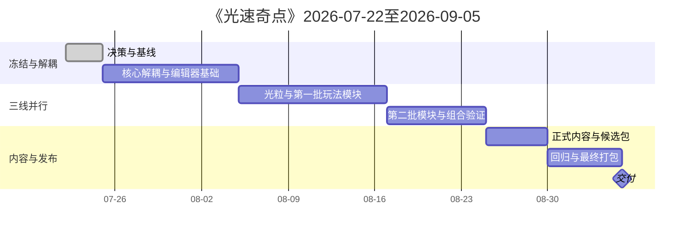

# 《光速奇点》项目管理

> 版本：v0.7
> 更新日期：2026 年 7 月 22 日
> 截止日期：2026 年 9 月 5 日
> 团队：陈俊贤、潘陈俣、张梓涵
> 目标平台：Windows 10/11 x86_64

---

# 1. 管理目标

在9月5日前交付一个：

- 可独立运行；
- 有三章节结构；
- 支持光线和光粒；
- 可在Godot GUI制作关卡；
- 有最小科学家成就内容；
- 有Windows构建；
- 可继续扩展完整设计的版本。

9月5日是阶段性交付，不是完整设计永久结束。附加内容进入9月5日后的继续开发路线。

---

# 2. 范围分级

## P0：9月5日前必须完成

- 模块解耦；
- GUI网格吸附；
- 四方向发射器；
- 开始运行按钮；
- 普通光线；
- 光粒；
- 基础镜面；
- 加速和减速；
- 一种光粒专属墙体；
- 基础和光形态水晶；
- 运行期布局编辑；
- 移动次数；
- R重置；
- 三章节代表关卡；
- 主界面和选关；
- 最小存档；
- 1位重点科学家；
- 3项成就；
- Windows包。

## P1：阶段附加

- 长镜面；
- 分光器；
- 滤光片；
- 颜色水晶；
- 转换器；
- 墙体消除器；
- 同时/顺序水晶。

## P2：9月5日后完整开发

- 光电二极管；
- 电控门；
- 电动镜面；
- 次级发射器；
- 特殊持续光线；
- 更多科学家和成就；
- 完整章节关卡；
- 更完整声音、动画、设置和内容。

---

# 3. 时间计划

| 阶段 | 日期 | 里程碑 |
|---|---|---|
| 阶段0 | 7月22日晚—7月24日 | 决策、文档、分支和测试基线 |
| 阶段1 | 7月25日—8月4日 | 核心解耦、编辑器关卡基础 |
| 阶段2 | 8月5日—8月16日 | 光粒与第一批机关，三线并行 |
| 阶段3 | 8月17日—8月24日 | 第二批内容、组合验证、功能冻结 |
| 阶段4 | 8月25日—8月29日 | 正式内容、首个候选包 |
| 阶段5 | 8月30日—9月4日 | 回归、修复和最终构建 |
| 交付 | 9月5日 | 最终确认和备份 |



---

# 4. 三线并行管理

## 架构线：陈俊贤

每次只抽离一个职责，保护当前行为。公共接口变更必须通知另外两人。

## 玩法线：潘陈俣

机关必须使用公共接口。每个机关需要场景、脚本、配置、测试和规则说明。

## 关卡内容线：张梓涵

从阶段1开始制作灰盒，不等全部机关完成。正式关卡只使用稳定模块。

---

# 5. 任务流程

```text
Issue
→ 规则和依赖确认
→ 从最新main建分支
→ 实施
→ 自动检查
→ 人工测试
→ 只读审查
→ PR
→ 队友运行
→ 合并main
→ 删除分支
```

每个人同时主要任务不超过2个。

---

# 6. 任务完成定义

一个任务只有同时满足以下条件才完成：

```text
代码/内容存在
+ 可运行
+ 有测试步骤
+ 有实际测试结果
+ 已知问题已记录
+ 至少一名队友检查
+ 已合并main
+ main仍可运行
```

---

# 7. 重构管理

## 禁止大型重写

`core_loop_prototype.gd` 的迁移按顺序进行：

1. 基线记录；
2. 自检和日志；
3. 运行状态；
4. 发射器；
5. 普通光线；
6. 库存；
7. 玩家操作；
8. 重置协调。

每一步独立分支、独立回归。

## 停止条件

出现以下情况立即停止继续抽离：

- 主场景不能启动；
- R不能恢复；
- 占用不一致；
- 库存不一致；
- 光路结果改变；
- 拖拽回滚失效；
- 新模块需要直接改多个私有字段；
- 测试无法说明行为是否保持。

---

# 8. 关卡管理

关卡分为：

- 模板；
- 单机关原型；
- 组合原型；
- 灰盒关卡；
- 正式章节关卡。

三章节不改变：

- 光粒；
- 光线；
- 混合。

9月5日前数量弹性，但每章必须有代表性正式内容。内部目标每章约2关，进度不足时缩小规模而不删除章节。

同一时间一名成员主改一个关卡场景，避免场景冲突。

---

# 9. 风险

| 风险 | 等级 | 应对 |
|---|---|---|
| 一次性重写核心脚本 | 高 | 行为保持式小步迁移 |
| 三人同时修改主场景 | 高 | 场景所有权和独立测试场景 |
| 光粒Tick延期 | 高 | 优先最小直线传播，再加速度 |
| 附加机关过多 | 高 | P0/P1/P2分级 |
| GUI编辑接口不稳定 | 高 | 阶段1由张梓涵实际验证 |
| 文档与代码冲突 | 中 | 当前决定和真实代码优先 |
| 日志无限增长 | 中 | 文件轮转、数量和容量上限 |
| 关卡过晚开始 | 高 | 阶段1开始灰盒 |
| AI越权修改 | 中 | 明确允许/禁止文件 |
| Windows导出问题 | 高 | 8月29日前首个候选包 |

---

# 10. 缺陷等级

- **S0**：项目打不开、必现崩溃、存档损坏、主流程阻断；
- **S1**：核心机关错误、关卡无法完成、重置错乱、可绕过核心限制；
- **S2**：明显UI、反馈、文本和局部表现问题；
- **S3**：不影响使用的小问题。

8月30日后只处理S0、S1和必要S2。

---

# 11. 每周检查

每周至少一次：

- main是否可运行；
- 三条线完成情况；
- 被阻塞任务；
- 下周三项最高优先级；
- P1是否需要延后；
- 关卡数量是否需要缩小；
- 新风险；
- 是否接近功能冻结。

---

# 12. 交付验收

9月5日前：

- S0为0；
- 无已知主流程S1；
- 两台以上Windows电脑运行；
- 三章节结构完整；
- 光线和光粒可用；
- 开始运行门可用；
- GUI关卡编辑可用；
- 日志不会无限增长；
- 1位重点科学家、3项成就；
- Windows包、源码、README、来源、授权和已知问题齐全；
- 构建与最终Git提交对应。
